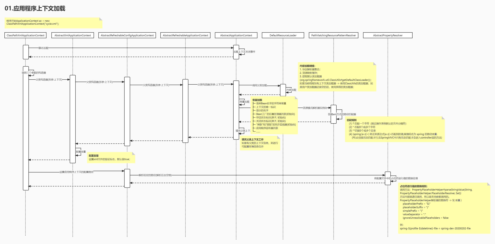

#  Spring Framework 

# 1. 项目概述

该项目仅代表自己关于Spring源码的理解，不涉及任何商业用途；如有内容侵犯您的版权或其他利益的，请编辑邮件并加以说明发送到我的邮箱bluecrow@qq.com，收到邮件后我会三个工作日内处理。

# 2. 代码及工具说明

## 2.1 代码版本及下载

版本(分支)：`5.2.9.RELEASE`

源码地址：https://github.com/spring-projects/spring-framework.git

## 2.2 Gradle版本

根据项目内的gradle配置，使用的对应版本“5.6.4”；

下载地址：https://downloads.gradle-dn.com/distributions/gradle-5.6.4-all.zip

# 3. 学习进度

## 3.1 应用程序上下文加载

