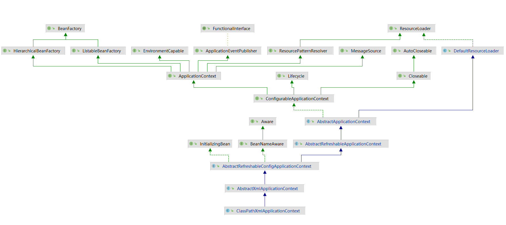

# 0. 前言

本文以XML方式注册进行测试和总结；

测试代码位置

> spring-debug/src/main/java/com/bluecrow/cycle

调试步骤：

> 打开 `"TestCycle.java"` 在 `ApplicationContext` 实例化处打上断点；
>
> 
>
> Idea -> 调试
>
> 以下所有步骤能"步入"的就步入，详细步骤就略过了...


# 1. 总述

`ClassPathXmlApplicationContext`类图：



根据调试代码可以看出，通过接口 `"ApplicationContext"` 在实例化的时候，实现的类即是该类 `"ClassPathXmlApplicationContext"` ；这个也就是“应用程序上下文”的入口，观察类图（从接口开始，自上而下），分析（目前只考虑 `“应用程序上下文”` ）：

> 1. 资源加载器的接口 `ResourceLoader` ；
> 2. 资源加载器的默认实现 `DefaultResourceLoader` ；
> 3. 抽象应用程序上下文 `AbstractApplicationContext` 继承了 `DefaultResourceLoader` ，并且实现了 `ConfigurableApplicationContext(配置应用程序上下文)`，这里从表面上来看可分析出应用程序的上下文包含了资源加载器，并且 **可能** 完成了应用程序上下文件的配置(这个可能是因为该类为抽象类)；
> 4. 抽象可刷新的应用程序上下文 `AbstractRefreshableApplicationContext` 继承了 `AbstractApplicationContext` ，所以从字面上分析是在抽象应用程序上下文做的刷新功能的补充；
> 5. 抽象可刷新配置应用程序上下文 `AbstractRefreshableConfigApplicationContext` 继承了 `AbstractRefreshableApplicationContext` ，所以从字面上分析是在抽象可刷新的应用程序上下文做的配置功能的补充；
> 6. 抽象XML应用程序上下文 `AbstractXmlApplicationContext `继承了 `AbstractRefreshableConfigApplicationContext` ，此处应实现的是XML类型的配置文件解析；
> 7. 最终的实现：类路径 Xml 应用程序上下文 `ClassPathXmlApplicationContext` 继承了 `AbstractXmlApplicationContext ` ，总述应该实现了以下功能：
>    - 加载器的引用；
>    - 配置文件（资源）路径解析；
>    - 配置文件内容（XML）解析；
>    - 资源的刷新机制；

# 2. 程序上下文加载

## 2.1 `AbstractApplicationContext` 静态代码块优先处理

```java
	// 静态块用于事前进行加载, 处理实例化前的准备工作
	static {
		// Eagerly load the ContextClosedEvent class to avoid weird classloader issues
		// on application shutdown in WebLogic 8.1. (Reported by Dustin Woods.)
		// 优先加载上下文关闭事件来防止奇怪的类加载问题在应用程序关闭的时候
		ContextClosedEvent.class.getName();
	}

```

## 2.2 `ClassPathXmlApplicationContext` 构造器实现

1. 从xml文件中加载给定的bean定义信息，并且刷新上下文；

2. 调用三个参数的构造器(资源位置, 自动刷新, 无父上下文)；

3. 调用父类（`AbstractXmlApplicationContext `）构造方法, 进行相关的对象创建等操作, 包含属性的赋值操作；一直向父级调用其构造方法，直至 `AbstractApplicationContext` 开始干活；

   - `AbstractApplicationContext`入口是有一个参数的构造器(参数可为null)；

     - 先调用自己的无参构造器(创建一个无父类的上下文)；

       ```java
       	/**
       	 * 创建一个无父类的AbstractApplicationContext对象
       	 * 1. 进入构造器之前需要先进行父类的加载(DefaultResourceLoader)
       	 * 2. 该类内部的常量加载
       	 * ┠─ 各种Bean名字的字符串常量
       	 * ┠─ 上下文的唯一标识
       	 * ┠─ 显示的名字
       	 * ┠─ Bean工厂的后置处理器列表(初始化)
       	 * ┠─ 存活状态标识(原子, 初始化)
       	 * ┠─ 关闭状态标识(原子, 初始化)
       	 * ┠─ "刷新"和"销毁"的同步监视器(初始化)
       	 * ┠─ 应用程序监听器列表
       	 * ┖─ ……
       	 * 3. 创建资源模式处理器
       	 */
       ```

     - 再把父类的上下文进行填充；

   -  `AbstractXmlApplicationContext` 标识赋默认值：

     - 设置xml文件的验证标志，默认是true；

4. 设置应用程序上下文的配置路径(包含路径的解析)：

   -  `AbstractRefreshableConfigApplicationContext` ，设置应用程序上下文的配置路径：

     - 当前类的全局变量配置路径进行初始化；

     - 解析给定的路径(解析后去空格)，通过当前的解析器（如果未定义，用默认的 `PropertyPlaceholderHelper`）进行字符串递归替换；

       ```java
       	// 将配置文件中的占位符进行值的替换处理
       	private String doResolvePlaceholders(String text, PropertyPlaceholderHelper helper) {
       		/**
       		 * 再往里走会找到递归调用进行替换, 所以替换符是可以多层嵌套的
       		 * {@link PropertyPlaceholderHelper#parseStringValue(String, PropertyPlaceholderHelper.PlaceholderResolver, Set)}
       		 * 例:
       		 * spring-${profile-${datetime}}-file	-> spring-dev-20200202-file
       		 */
       		return helper.replacePlaceholders(text, this::getPropertyAsRawString);
       	}
       ```

5. 此时应用程序上下文加载结束，根据上述 `步骤2` 中调用构造器形参的自动刷新，接下来就开始进入到容器的创建和刷新环节，也就是大名鼎鼎的 `IoC的生命周期`了。

